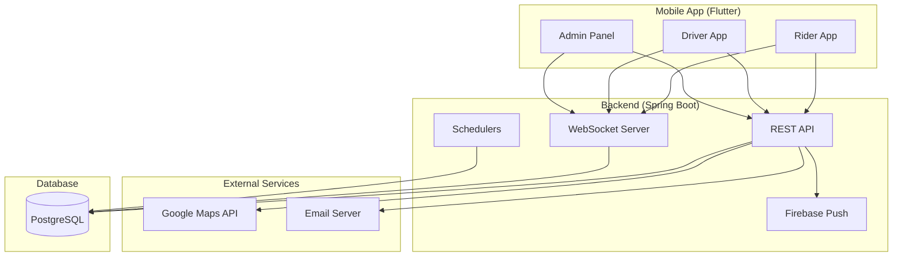
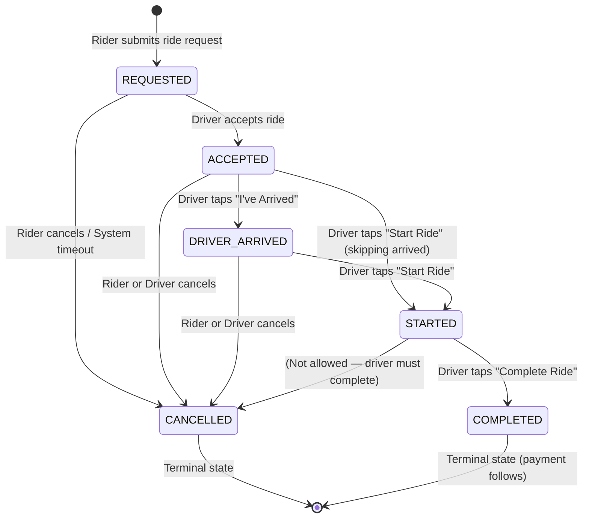
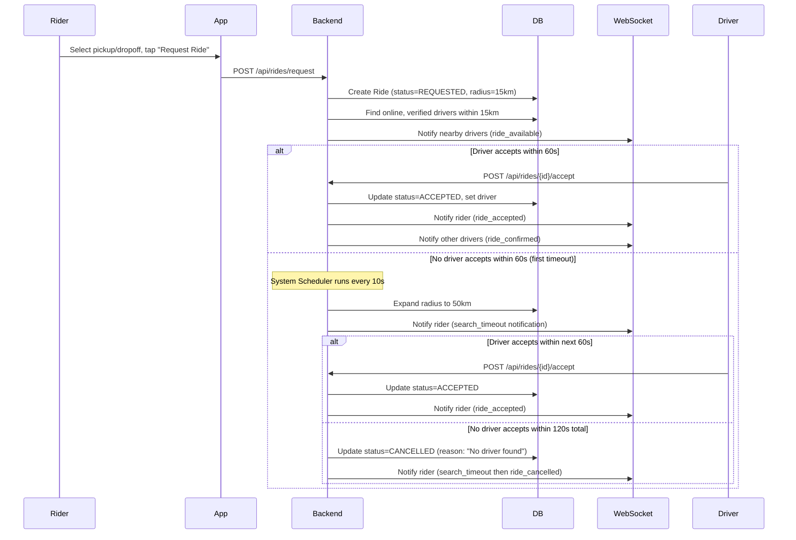
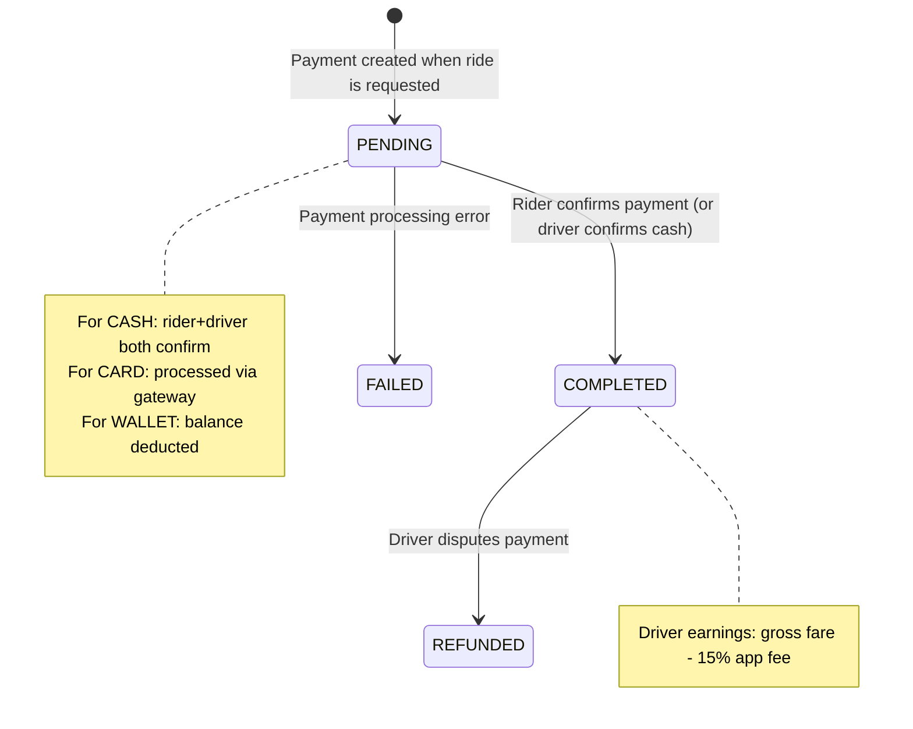
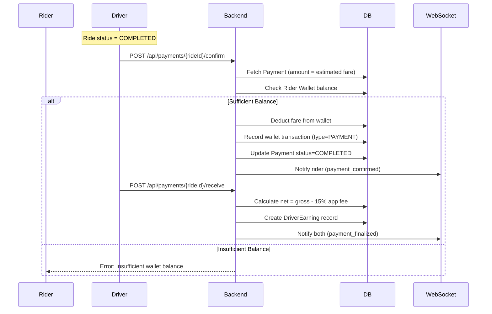
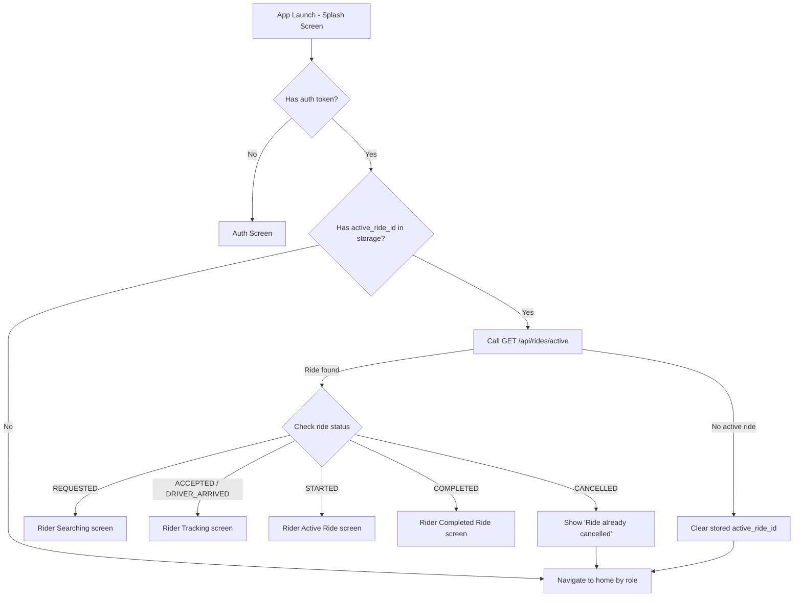

# Ride-Hailing Chat Application — Business Documentation

> **Project:** Decentralized Chat / RideNow  
> **Scope:** Full system — Flutter mobile app + Java Spring Boot backend  
> **Audience:** Non-programmers (product managers, QA, stakeholders)  
> **Date:** 2026-07-10

---

## Table of Contents

1. [System Overview](#1-system-overview)
2. [Actors and Their Goals](#2-actors-and-their-goals)
3. [Feature Inventory](#3-feature-inventory)
4. [Ride Lifecycle (State Machine)](#4-ride-lifecycle-state-machine)
5. [Driver Matching & Dispatching](#5-driver-matching--dispatching)
6. [Payment & Earnings Flow](#6-payment--earnings-flow)
7. [Chat System](#7-chat-system)
8. [Screen Navigation Map](#8-screen-navigation-map)
9. [API Interactions (Backend Endpoints)](#9-api-interactions-backend-endpoints)
10. [WebSocket Events](#10-websocket-events)
11. [Database Entities (ERD)](#11-database-entities-erd)
12. [Scheduled Tasks (Background System)](#12-scheduled-tasks-background-system)
13. [Admin Panel](#13-admin-panel)
14. [App Restart Recovery](#14-app-restart-recovery)

---

## 1. System Overview

The system is a **ride-hailing platform** with real-time chat, live GPS tracking, wallet payments, and an admin investigation panel. It connects **Riders** who need transportation with **Drivers** who provide it.

### High-Level Architecture



### Key Technologies

| Component | Technology |
|-----------|-----------|
| Mobile App | Flutter (Dart) |
| State Management | Provider |
| Local Cache | SQLite (sqflite) |
| Backend | Java 21, Spring Boot 3 |
| Database | PostgreSQL (via JPA/Hibernate) |
| Real-time | WebSockets (raw, not STOMP) |
| Push Notifications | Firebase Cloud Messaging (FCM) |
| Maps | Google Maps API (Directions, Geocoding) |
| Auth | JWT (JSON Web Tokens) |
| Email | Spring Mail (SMTP) |

---

## 2. Actors and Their Goals

### Rider
- Create an account and log in
- Request a ride by selecting pickup & dropoff locations
- Track the driver in real-time on a map
- Chat with the driver during the ride
- Pay for the ride (Cash / Card / Wallet)
- Rate the driver after the trip
- View ride history

### Driver
- Register as a driver (provide license, vehicle info)
- Go online/offline to indicate availability
- Receive ride requests from nearby riders
- Navigate to pickup location, then to destination
- Chat with the rider
- Accept payment (cash confirmation or wallet receipt)
- Rate the rider after trip
- View trip history and earnings

### Admin
- View all rides with search/filter
- Inspect detailed ride audit trail (state changes, timestamps)
- View driver details and current status
- Read chat messages between riders and drivers
- Add admin notes to rides
- Toggle audit retention for specific rides

### System (Automated Background Tasks)
- Driver matching: find nearby drivers when a ride is requested
- Ride timeout: cancel rides if no driver accepts within the time limit
- Search radius expansion: automatically increase search radius
- Driver inactivity detection: set drivers offline if no location update for 10 minutes
- Audit log cleanup: purge old audit events after 2 months (unless marked for retention)

---

## 3. Feature Inventory

### Authentication & Account
- Email + password registration
- Login/logout
- JWT-based session management
- Forgot password flow with email OTP (6-digit code, 10-minute expiry)
- Device token registration (for push notifications)
- Role selection at registration: Rider or Driver
- Phone number capture (with country code)

### Rider Features
- Interactive map with pickup location selection (pan to choose)
- Dropoff location selection with address search
- Route preview with polyline, distance, and ETA
- Ride type selection: ECONOMY or LUXURY
- Fare estimate display
- Driver search with animated waiting screen
- Real-time driver location tracking on map (driver en-route to pickup)
- Active ride screen with destination map
- Ride completion screen with trip summary
- Driver rating (1–5 stars with optional feedback)
- Ride history (paginated)
- Payment method selection: Cash, Card, or Wallet

### Driver Features
- Online/offline toggle
- Available ride requests list (sorted by distance)
- Audio/vibration alert on new ride request
- Ride preview before accepting
- Navigation route to pickup location (with external Google Maps option)
- "I've Arrived" button to notify rider
- Navigation route to dropoff location
- Ride start/complete controls
- Cash payment handling: Received / Unpaid
- Ride summary with earnings breakdown (gross fare, app fee, net amount)
- Rider rating (1–5 stars with optional feedback)
- Trip history

### Wallet & Payments
- In-app wallet with balance tracking
- Wallet top-up (recorded via backend, external payment integration not shown)
- Fare payment from wallet (auto-debit on ride completion)
- Refund: disputed payments refunded to rider's wallet
- Driver earnings: 15% app fee deducted, net credited to driver's earning record
- Payment status tracking: PENDING → COMPLETED → FAILED/REFUNDED
- Cash payment flow: driver confirms receipt or marks as unpaid

### Real-Time Chat
- One-to-one chat between rider and driver during an active ride
- Message delivery status: sent → delivered → seen
- Typing indicators
- Push notifications for new messages (FCM)
- Chat history retrieval

### Notifications
- Push notifications via Firebase Cloud Messaging
- In-app notification list with read/unread status
- Notification types: chat messages, ride events
- Unread count badge
- Mark individual or all notifications as read
- Delete all notifications

### Admin Panel
- Trip listing with pagination and filters:
  - Ride ID, Status, Payment Status
  - Rider name, Driver name
  - Date range (from/to)
- Trip detail view:
  - Rider info (name, email, username)
  - Driver info (name, email, vehicle details, rating)
  - Payment info (method, amount, status, timestamps)
  - Full ride timeline with all state transitions
  - Chat messages between rider and driver
  - Admin notes (add/view)
  - Audit retention toggle (keep forever / allow deletion)
- Driver list with current status
- Driver detail view:
  - Personal info, vehicle info, online/active/verified status
  - Current ride (if any) with status
  - Recent rides list
  - Total earnings
  - Average rating

### Maps & Location
- Google Maps integration for route calculation (Directions API)
- Address resolution via reverse geocoding
- Fallback to straight-line route if API unavailable
- Real-time driver location streaming via WebSocket
- Location history tracking (stored in database)
- Background location updates (driver)
- Polyline rendering on map for route visualization

---

## 4. Ride Lifecycle (State Machine)

A ride progresses through exactly **6 states**. Transitions are strictly enforced:



### State Transition Rules

| Current State | Can Transition To | Triggered By |
|---|---|---|
| REQUESTED | ACCEPTED, CANCELLED | Driver accepts; Rider or timeout cancels |
| ACCEPTED | DRIVER_ARRIVED, STARTED, CANCELLED | Driver arrives; Driver starts; Either cancels |
| DRIVER_ARRIVED | STARTED, CANCELLED | Driver starts; Either cancels |
| STARTED | COMPLETED | Driver completes |
| COMPLETED | (none) | Terminal |
| CANCELLED | (none) | Terminal |

### State Timing Events (Timestamps Recorded)

Each state transition records an exact timestamp:
- `requestedAt` — when ride was created
- `acceptedAt` — when driver accepted
- `driverArrivedAt` — when driver notified arrival
- `startedAt` — when driver began trip
- `completedAt` — when driver ended trip
- `cancelledAt` — when ride was cancelled (+ `cancellationReason`)

---

## 5. Driver Matching & Dispatching



### Key Decision Points

| Decision | Who Makes It | Logic |
|---|---|---|
| **Which drivers are notified?** | System | Online + verified drivers within search radius (initially 15 km) |
| **How long does a rider wait?** | System | 60 seconds at 15 km, then expand to 50 km, then 60 more seconds → total 120s timeout |
| **Who gets the ride?** | First driver to accept | Whichever driver calls `POST /api/rides/{id}/accept` first (optimistic locking via `@Version`) |
| **When does search radius expand?** | System | If no driver accepts after 60 seconds (1st timeout notification), radius expands from 15 km to 50 km |
| **When is a ride cancelled automatically?** | System | After 120 seconds total with no acceptance (2nd timeout → cancel) |
| **Can rider continue searching after timeout?** | Rider | Yes — rider taps "Continue Searching" → `POST /api/rides/{id}/continue-search` resets the search timer |
| **How does driver see available rides?** | WebSocket + REST | Driver receives real-time `ride_available` event AND can poll `GET /api/rides/available` |

---

## 6. Payment & Earnings Flow

### Payment Methods

| Method | How It Works |
|---|---|
| **Cash** | Rider pays driver directly in cash. Driver confirms receipt in app. |
| **Card** | In-app card payment (processing assumed external). |
| **Wallet** | Auto-deducted from rider's wallet balance on payment confirmation. |

### Payment Lifecycle



### Flow Detail (Wallet Payment Example)



### Driver Earnings Calculation

```
Gross Fare (paid by rider)   = 100.00 SAR
App Fee (15%)                =  15.00 SAR
Net Driver Earnings          =  85.00 SAR
```

### Dispute Flow
1. Driver disputes payment → `POST /api/payments/{rideId}/dispute`
2. Payment status changes to REFUNDED
3. Rider wallet receives full refund (via wallet transaction type=REFUND)
4. Cash disputes do not refund (already paid in person)

---

## 7. Chat System

### When Chat is Available
- Only between a Rider and Driver who have an **active ride together**
- Chat window accessible from any ride screen (tracking, active, driver navigation)

### Message Lifecycle

```
sent → delivered → seen
```

- **sent**: Message persisted to database, FCM push sent to receiver
- **delivered**: Receiver's app acknowledges delivery via WebSocket (`message_delivered`)
- **seen**: Receiver opens the chat and reads the message (`message_read` via WebSocket or REST)

### WebSocket vs REST

| Channel | Use Case |
|---|---|
| **WebSocket** | Real-time message delivery, typing indicators, delivery/read receipts |
| **REST API** | Chat history retrieval (`GET /api/chat/history`), explicit mark-read fallback |

### Push Notifications
- When a message is sent, FCM push is sent to the receiver
- Payload includes: sender name, message preview, screen destination (`chat`)

---

## 8. Screen Navigation Map

```mermaid
graph TD
    S[Splash Screen] -->|no session| A[Auth Screen]
    S -->|has session, role=RIDER| RH[Rider Home]
    S -->|has session, role=DRIVER| DH[Driver Home]
    S -->|has session, pending payment| RAR[Rider Active Ride]

    A -->|login/register as RIDER| RH
    A -->|login/register as DRIVER| DR[Driver Registration]
    A -->|forgot password| FP[Forgot Password]
    A -->|debug mode| DBG[Debug Screen]

    FP -->|send OTP| OTP[OTP Screen]
    OTP -->|verify OTP| RP[Reset Password]
    RP -->|done| A

    DR -->|register| DH

    RH -->|tap "Where to?"| RPL[Rider Pickup Location]
    RH -->|tap recent trip| RDL[Rider Dropoff Location*]
    RH -->|settings| SET[Settings]
    RH -->|menu - debug| DBG
    RH -->|menu - admin| AH[Admin Home]
    RH -->|menu - rides| HIS[Ride History]
    RH -->|logout| S

    RPL -->|confirm pickup| RDL[Rider Dropoff Location]
    RDL -->|request ride| RSS[Rider Searching]
    RDL -->|skip back| RPL

    RSS -->|driver found| RT[Rider Tracking]
    RSS -->|cancel/timeout| RH
    RSS -->|continue search| RSS

    RT -->|driver arrived/ride started| RAR
    RT -->|cancel| RH
    RT -->|chat| CS[Chat Screen]

    RAR -->|ride completed| RC[Rider Completed Ride]
    RAR -->|cancel| RH
    RAR -->|chat| CS
    RAR -->|payment done| RC

    RC -->|rate driver / done| RH

    DH -->|accept ride| DN[Driver Navigation]
    DH -->|settings| SET
    DH -->|menu - rides| HIS
    DH -->|logout| S
    DH -->|debug| DBG

    DN -->|"I've Arrived"| DAR[Driver Active Ride]
    DN -->|cancel| DH
    DN -->|chat| CS

    DAR -->|start ride| DAR
    DAR -->|complete ride| DS[Driver Ride Summary]
    DAR -->|cash received/unpaid| DS
    DAR -->|cancel| DH
    DAR -->|chat| CS

    DS -->|rate rider / done| DH

    AH -->|tap trip| ATD[Admin Trip Details]

    CS -->|back| previous_screen
```

---

## 9. API Interactions (Backend Endpoints)

### Authentication (`/api/auth`)

| Method | Endpoint | Purpose | Actor |
|---|---|---|---|
| POST | `/api/auth/register` | Create account (email, password, phone, role) | Rider/Driver |
| POST | `/api/auth/login` | Log in, returns JWT token + role | Rider/Driver |
| POST | `/api/auth/device-token` | Register FCM device token for push | Rider/Driver |
| POST | `/api/auth/forgot-password` | Request password reset OTP (emailed) | Rider/Driver |
| POST | `/api/auth/verify-reset-otp` | Verify OTP code validity | Rider/Driver |
| POST | `/api/auth/reset-password` | Set new password using verified OTP | Rider/Driver |

### Rides (`/api/rides`)

| Method | Endpoint | Purpose | Actor |
|---|---|---|---|
| POST | `/api/rides/request` | Create a new ride request | Rider |
| GET | `/api/rides/available` | List rides with status=REQUESTED | Driver |
| POST | `/api/rides/{id}/accept` | Accept a ride request | Driver |
| POST | `/api/rides/{id}/start` | Start the ride (begin trip) | Driver |
| POST | `/api/rides/{id}/complete` | Mark ride as completed | Driver |
| POST | `/api/rides/{id}/driver-arrived` | Notify that driver arrived at pickup | Driver |
| POST | `/api/rides/{id}/cancel` | Cancel a ride (with reason) | Rider/Driver |
| POST | `/api/rides/{id}/continue-search` | Continue search after timeout | Rider |
| POST | `/api/rides/{id}/location` | Update ride location during trip | Driver |
| GET | `/api/rides/{id}` | Get ride details | Rider/Driver |
| GET | `/api/rides/active` | Check if user has active ride | Rider/Driver |
| GET | `/api/rides/driver/active` | Get driver's currently active ride | Driver |
| GET | `/api/rides/user/history` | Get paginated ride history | Rider/Driver |
| GET | `/api/rides/matching/nearby-drivers` | Find nearby drivers (lat/lng/radius) | System |
| GET | `/api/rides/matching/requested` | List all requested rides | System |
| GET | `/api/rides/matching/statistics` | Get online driver count + total rides | System |

### Driver Profile (`/api/drivers`)

| Method | Endpoint | Purpose | Actor |
|---|---|---|---|
| POST | `/api/drivers/register` | Register as a driver (license, vehicle) | Driver |
| GET | `/api/drivers/profile` | Get own driver profile | Driver |
| PUT | `/api/drivers/profile` | Update driver profile | Driver |
| POST | `/api/drivers/location` | Update current GPS location | Driver |
| POST | `/api/drivers/toggle-online` | Go online/offline | Driver |
| GET | `/api/drivers/nearby` | List nearby drivers (public) | Anyone |

### Payments (`/api/payments`)

| Method | Endpoint | Purpose | Actor |
|---|---|---|---|
| GET | `/api/payments/pending-ride` | Get ride ID with pending payment | Rider |
| GET | `/api/payments/{id}/status` | Get payment status for a ride | Rider/Driver |
| POST | `/api/payments/{id}/confirm` | Rider confirms payment (wallet/card) | Rider |
| POST | `/api/payments/{id}/receive` | Driver confirms payment received | Driver |
| POST | `/api/payments/{id}/cash-received` | Driver confirms cash received | Driver |
| POST | `/api/payments/{id}/cash-unpaid` | Driver marks cash as unpaid | Driver |
| POST | `/api/payments/{id}/dispute` | Driver disputes payment | Driver |

### Chat (`/api/chat`)

| Method | Endpoint | Purpose | Actor |
|---|---|---|---|
| POST | `/api/chat/send` | Send a message | Rider/Driver |
| GET | `/api/chat/history` | Get message history between two users | Rider/Driver |
| POST | `/api/chat/{id}/mark-delivered` | Mark message as delivered | Rider/Driver |
| POST | `/api/chat/{id}/mark-read` | Mark message as read | Rider/Driver |

### Ratings (`/api/ratings`)

| Method | Endpoint | Purpose | Actor |
|---|---|---|---|
| POST | `/api/ratings` | Submit a rating (1-5 + feedback) | Rider/Driver |
| GET | `/api/ratings/user/{id}` | Get all ratings for a user | Anyone |

### Notifications (`/api/notifications`)

| Method | Endpoint | Purpose | Actor |
|---|---|---|---|
| GET | `/api/notifications` | Get user's notifications | Rider/Driver |
| GET | `/api/notifications/unread-count` | Get unread notification count | Rider/Driver |
| POST | `/api/notifications/{id}/read` | Mark notification as read | Rider/Driver |
| POST | `/api/notifications/read-all` | Mark all as read | Rider/Driver |
| DELETE | `/api/notifications` | Delete all notifications | Rider/Driver |

### Location History (`/api/locations`)

| Method | Endpoint | Purpose | Actor |
|---|---|---|---|
| POST | `/api/locations/update` | Record location update (with optional rideId) | Rider/Driver |

### Routes (`/api/routes`)

| Method | Endpoint | Purpose | Actor |
|---|---|---|---|
| GET | `/api/routes/geocode` | Reverse geocode lat/lng → address | Any |
| GET | `/api/routes/calculate` | Get route (distance, duration, polyline) | Any |

### Admin (`/api/admin`)

| Method | Endpoint | Purpose | Actor |
|---|---|---|---|
| GET | `/api/admin/rides` | List rides with filters and pagination | Admin |
| GET | `/api/admin/rides/{id}` | Detailed ride view (with timeline) | Admin |
| GET | `/api/admin/rides/{id}/events` | Audit events for a ride (paginated) | Admin |
| GET | `/api/admin/rides/{id}/messages` | Chat messages for a ride (paginated) | Admin |
| PATCH | `/api/admin/rides/{id}/keep-forever` | Toggle audit retention | Admin |
| POST | `/api/admin/rides/{id}/notes` | Add admin note to ride | Admin |
| GET | `/api/admin/drivers` | List all drivers | Admin |
| GET | `/api/admin/drivers/{id}` | Detailed driver view | Admin |

### Users (`/api/users`)

| Method | Endpoint | Purpose | Actor |
|---|---|---|---|
| GET | `/api/users` | List all users (admin only) | Admin |
| GET | `/api/users/{id}` | Get user by ID | Anyone |
| POST | `/api/users/{id}/logout` | Log out (cancel active rides, set offline) | Rider/Driver |

---

## 10. WebSocket Events

### Connection

The client connects to `ws://{server}/ws?userId={id}&username={name}` and immediately sends:
```json
{ "type": "login", "senderId": 123, "senderName": "John", "timestamp": "..." }
```

A heartbeat pings every **2 minutes** to keep the connection alive:
```json
{ "type": "heartbeat", "senderId": 123, "timestamp": "..." }
```

### Events Sent by Client (App → Server)

| Event Type | When | Payload Highlights |
|---|---|---|
| `login` | On connect | senderId, senderName |
| `message` | Sending a chat message | senderId, receiverId, content |
| `typing` | User typing | senderId, receiverId, isTyping |
| `message_delivered` | Message received on device | messageId, senderId, receiverId |
| `message_read` | Chat screen opened | senderId, receiverId |
| `ride_status_update` | Ride state change | rideId, status, driverId |
| `online` | Going online | senderId, senderName |
| `offline` | Going offline | senderId |
| `driver_location` | Driver location update | rideId, latitude, longitude, heading |
| `heartbeat` | Keep-alive (every 2 min) | senderId |

### Events Received by Client (Server → App)

| Event Type | Who Receives It | When |
|---|---|---|
| `ride_available` | Nearby drivers | New ride requested within driver's radius |
| `ride_accepted` | Rider | Driver accepted the ride |
| `ride_confirmed` | Other drivers | A driver was assigned to the ride |
| `driver_arrived` | Rider | Driver notified arrival at pickup |
| `ride_started` | Rider | Trip has started |
| `ride_completed` | Rider | Trip has ended |
| `ride_cancelled` | Rider + Driver | Ride was cancelled |
| `search_timeout` | Rider | 60s elapsed with no driver found |
| `payment_confirmed` | Rider + Driver | Payment confirmed |
| `payment_finalized` | Rider + Driver | Driver earnings recorded |
| `payment_refunded` | Rider | Payment refunded (driver disputed) |
| `driver_location` | Rider | Real-time driver GPS update during ride |
| `driver_heading` | Rider | Driver's heading/bearing |
| `message` | Receiver | Incoming chat message |
| `message_delivered` | Sender | Message delivered to receiver's device |
| `message_read` | Sender | Message read by receiver |
| `typing` | Receiver | Other user typing indicator |
| `user_online` | Both | User came online |
| `user_offline` | Both | User went offline |
| `pong` | Sender | Heartbeat response |
| `force_logout` | Sender | Same account logged in elsewhere |

---

## 11. Database Entities (ERD)

```mermaid
erDiagram
    users ||--o{ rides : "rider"
    users ||--o{ rides : "driver"
    users ||--o{ driver_profiles : "has"
    users ||--o{ messages : "sender"
    users ||--o{ messages : "receiver"
    users ||--o{ notifications : "belongs_to"
    users ||--o{ ratings : "rater"
    users ||--o{ ratings : "ratee"
    users ||--o{ wallets : "has"
    users ||--o{ wallet_transactions : "has"
    users ||--o{ location_updates : "has"
    users ||--o{ otp_codes : "has"
    
    rides ||--o{ payments : "has"
    rides ||--o{ messages : "has"
    rides ||--o{ ratings : "has"
    rides ||--o{ ride_audit_events : "has"
    rides ||--o{ driver_earnings : "has"
    rides ||--o{ location_updates : "has"
    rides ||--o{ wallet_transactions : "has"
    
    wallets ||--o{ wallet_transactions : "has"
    driver_profiles ||--o{ driver_earnings : "has"

    users {
        bigint id PK
        varchar username UK
        varchar email UK
        varchar password
        varchar full_name
        varchar role "RIDER | DRIVER | ADMIN"
        varchar country_code
        varchar phone_number
        varchar normalized_phone UK
        boolean phone_verified
        boolean is_verified
        boolean is_online
        varchar device_token
        timestamp created_at
    }

    driver_profiles {
        bigint id PK
        bigint user_id FK UK
        varchar license_number
        varchar vehicle_number
        varchar vehicle_type
        varchar vehicle_model
        varchar vehicle_color
        boolean is_verified
        boolean is_active
        boolean is_online
        double average_rating
        bigint total_rides
        double current_latitude
        double current_longitude
        timestamp last_seen_at
        timestamp created_at
    }

    rides {
        bigint id PK
        bigint version "optimistic lock"
        bigint rider_id FK
        bigint driver_id FK nullable
        double pickup_latitude
        double pickup_longitude
        varchar pickup_address
        double dropoff_latitude
        double dropoff_longitude
        varchar dropoff_address
        varchar status "REQUESTED | ACCEPTED | DRIVER_ARRIVED | STARTED | COMPLETED | CANCELLED"
        varchar ride_type "ECONOMY | LUXURY"
        decimal estimated_fare
        decimal final_fare
        double estimated_distance
        bigint estimated_duration
        double search_radius_km
        timestamp requested_at
        timestamp accepted_at
        timestamp driver_arrived_at
        timestamp started_at
        timestamp completed_at
        timestamp cancelled_at
        timestamp last_timeout_notification
        varchar cancellation_reason
    }

    payments {
        bigint id PK
        bigint ride_id FK UK
        decimal amount
        varchar currency
        varchar payment_method "CASH | CARD | WALLET"
        varchar status "PENDING | COMPLETED | FAILED | REFUNDED"
        timestamp created_at
        timestamp completed_at
    }

    wallets {
        bigint id PK
        bigint user_id FK UK
        decimal balance
        timestamp created_at
    }

    wallet_transactions {
        bigint id PK
        bigint user_id FK
        decimal amount "positive=credit, negative=debit"
        varchar type "PAYMENT | REFUND | TOPUP"
        bigint ride_id FK nullable
        varchar description
        timestamp created_at
    }

    driver_earnings {
        bigint id PK
        bigint driver_id FK
        bigint ride_id FK
        decimal gross_amount
        decimal app_fee
        decimal net_amount
        varchar status
        timestamp created_at
    }

    messages {
        bigint id PK
        bigint sender_id FK
        bigint receiver_id FK
        text content
        varchar status "sent | delivered | seen"
        boolean is_read
        bigint ride_id nullable
        timestamp sent_at
    }

    ratings {
        bigint id PK
        bigint ride_id FK
        bigint rater_id FK
        bigint ratee_id FK
        int rating "1-5"
        text feedback
        timestamp created_at
    }

    notifications {
        bigint id PK
        bigint user_id FK
        varchar title
        text body
        varchar type
        boolean is_read
        varchar related_user_id
        timestamp created_at
    }

    ride_audit_events {
        bigint id PK
        bigint ride_id nullable
        varchar correlation_id
        timestamp timestamp
        varchar event_type
        varchar actor "RIDER | DRIVER | ADMIN | SYSTEM"
        bigint actor_id
        varchar actor_name
        text details "JSON map"
        varchar country
        varchar city
        boolean keep_forever
    }

    location_updates {
        bigint id PK
        bigint user_id FK
        bigint ride_id FK nullable
        double latitude
        double longitude
        timestamp updated_at
    }

    otp_codes {
        bigint id PK
        varchar email
        varchar code
        timestamp expires_at
        boolean used
        timestamp created_at
    }
```

### Entity Count: **14 tables**

---

## 12. Scheduled Tasks (Background System)

| Task | Schedule | What It Does |
|---|---|---|
| **Ride Timeout Detection** | Every 10 seconds (`@Scheduled(fixedRate = 10000)`) | Checks rides with status=REQUESTED. If elapsed > 60s and no timeout notified → expand radius to 50 km and notify rider. If elapsed > 120s → cancel ride with reason "No driver found". |
| **Driver Inactivity Check** | Every 60 seconds (`@Scheduled(fixedRate = 60000)`) | Checks drivers with isOnline=true. If last location update > 10 minutes ago → automatically set isOnline=false. |
| **Audit Log Cleanup** | Daily at 2:00 AM (`@Scheduled(cron = "0 0 2 * * ?")`) | Deletes ride audit events older than 2 months (except those marked `keep_forever = true`). |

---

## 13. Admin Panel

### Screens
1. **Trip Investigation Dashboard** — Filtered paginated list of all rides
2. **Trip Detail View** — Full ride information including timeline, chat, and notes

### Admin Capabilities

| Capability | Implementation |
|---|---|
| List all rides | Paginated, sorted by request date DESC |
| Filter by ride ID | Exact match |
| Filter by status | Dropdown of all RideStatus values |
| Filter by payment status | Dropdown: PENDING, COMPLETED, FAILED, REFUNDED, NONE |
| Filter by rider/driver name | Case-insensitive partial match |
| Filter by date range | From date / To date |
| View ride detail | Rider info, driver info, payment info, all timestamps, route coordinates |
| View audit timeline | All state transitions and events with timestamps and actor names |
| View chat messages | Full message history between rider and driver for that ride |
| Add admin notes | Written to audit log as ADMIM_NOTE event |
| Toggle audit retention | Prevents audit events from being purged by cleanup scheduler |
| List drivers | All drivers with current status and location |
| View driver detail | Personal info, vehicle, earnings, rating, current ride, recent rides |

---

## 14. App Restart Recovery

If the app is killed (crash, force close, etc.), upon restart it checks for an active ride:



### Recovery Mapping

| Ride Status | Navigation Target | Data Needed |
|---|---|---|
| REQUESTED | Rider Searching screen | rideId, pickup/dropoff address, fare |
| ACCEPTED | Rider Tracking screen | rideId, driver data (name, vehicle, location) |
| DRIVER_ARRIVED | Rider Tracking screen | rideId, driver data |
| STARTED | Rider Active Ride screen | rideId, pickup/dropoff coords, address |
| COMPLETED | Rider Completed Ride screen | rideId, fare, distance, duration |
| CANCELLED | Show message → Rider Home | None |

---

## Appendix: Business Rules Summary

1. **Driver must be verified and online** to receive ride requests
2. **Rider cannot have multiple active rides** — a new request is rejected if one exists
3. **Ride cancellation policy**: Rider or Driver can cancel at any time before STARTED; once STARTED, only Driver can complete (not cancel)
4. **App fee**: 15% of gross fare retained by the platform
5. **Cash unpaid**: Driver reports rider didn't pay; payment is marked FAILED
6. **Dispute**: Driver disputes a wallet/card payment; full refund to rider
7. **Driver auto-offline**: No location update for 10 minutes → auto-set offline
8. **Audit retention**: Events auto-deleted after 2 months unless ride is marked `keep_forever`
9. **OTP expiry**: Password reset codes expire after 10 minutes
10. **Rate limit**: Max 5 forgot-password requests per email per 15 minutes; max 10 OTP verify attempts per email per 15 minutes
11. **Message length limit**: 10,000 characters max per message
12. **Duplicate rating prevention**: A user can only rate a ride once (checked by rideId + raterId)
13. **Ride finish requirement**: Before a Driver can go offline or logout, any active ride must be completed or cancelled
